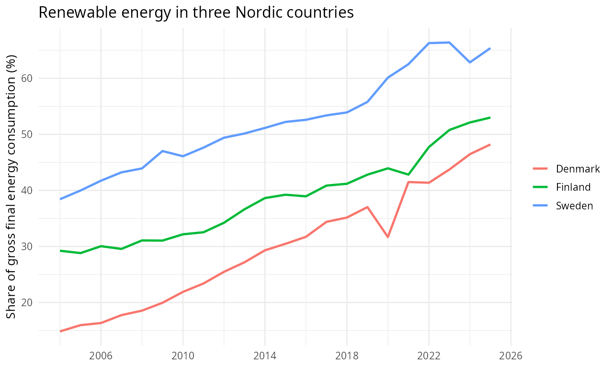

# Getting started with tosi

`tosi` provides consistent access to official statistics as ordinary R tables, with metadata and source context to help interpret them. Use the same search and retrieval workflow across sources, then rerun your analysis or report as new figures arrive. Each source's definitions and units still matter: a common interface does not make different measures interchangeable.

::: {.alert .alert-info}
TosiData is currently invitation-only. Contact [contact@tosidata.com](mailto:contact@tosidata.com) to request access.
:::

This walk-through uses Eurostat data on renewable energy, then takes a quick look at life expectancy.

```{r packages, eval=FALSE}
library(tosi)
library(dplyr)
library(ggplot2)
```

## Find a table

Start with a question: how has the share of renewable energy changed in Denmark, Finland, and Sweden? Search for a relevant table:

```{r search, eval=FALSE}
tosi_search("renewable energy", lang = "en")
```

The results include Eurostat's *Share of renewable energy in gross final energy consumption by sector*, at `eurostat/sdg_07_40`. Save its path so you can run the same request later. Inspect its schema before choosing a measure:

```{r schema, eval=FALSE}
path <- "eurostat/sdg_07_40"
tosi_schema(path, lang = "en")
```

The table offers an overall share as well as separate electricity, heating and cooling, and transport shares. We want **renewable energy overall**, measured as a **percentage of gross final energy consumption**—not the share of electricity alone.

## Make a chart

Retrieve the table and select three countries, keeping all available years. Column names use source labels by default; `lang = "en"` requests English labels and values. Backticks let us use column names that contain spaces. The `time` column holds the year as an R date, and `value` holds the observed percentage.

```{r renewables, eval=FALSE}
energy <- tosi_data(path, lang = "en")

renewables <- energy |>
  filter(
    `Energy balance` == "Renewable energy - overall",
    `Unit of measure` == "Percentage",
    `Geopolitical entity (reporting)` %in% c("Denmark", "Finland", "Sweden")
  )
```

```{r plot, eval=FALSE}
chart <- ggplot(
  renewables,
  aes(x = time, y = value, colour = `Geopolitical entity (reporting)`)
) +
  geom_line(linewidth = 1) +
  scale_x_date(date_breaks = "4 years", date_labels = "%Y") +
  labs(
    title = "Renewable energy in three Nordic countries",
    x = NULL,
    y = "Share of gross final energy consumption (%)",
    colour = NULL
  ) +
  theme_minimal(base_size = 12)
chart
```



All three countries increased their share of renewable energy over the available years, though the paths differ.

*Source: Eurostat, `sdg_07_40`.*

The chart and table below are saved illustrations. Rerunning the code may return revised data, and recent figures can be provisional.

## Try another question

The same client can retrieve another Eurostat table, *Life expectancy at birth by sex* (`eurostat/tps00205`). For a small comparison, choose both sexes together and 2024, then keep only the columns you need. Here we use `Time`, the source's year label, rather than the `time` date column:

```{r life, eval=FALSE}
life <- tosi_data("eurostat/tps00205", lang = "en") |>
  filter(
    Sex == "Total",
    `Geopolitical entity (reporting)` %in% c("Denmark", "Finland", "Sweden"),
    Time == "2024"
  ) |>
  transmute(
    Country = `Geopolitical entity (reporting)`,
    Year = Time,
    `Life expectancy (years)` = value
  ) |>
  arrange(Country)
life
```

| Country | Year | Life expectancy (years) |
|:--|--:|--:|
| Denmark | 2024 | 82.0 |
| Finland | 2024 | 82.2 |
| Sweden | 2024 | 83.8 |

*Source: Eurostat, `tps00205`. Life expectancy at birth, both sexes, in years.*

You can use the same search–inspect–retrieve pattern with other sources, then apply your usual R analysis. For more ways to find tables, request data, and inspect results, see the [function reference](../reference/remote_frontends.html). Rerunning a script saves manual downloads; it does not guarantee that past results stay fixed or that every source publishes at the same pace.
